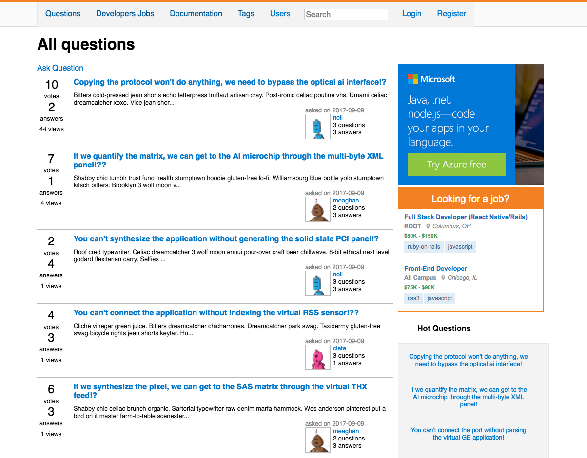

## [stackoverflow clone](http://dbcstackoverflow.herokuapp.com/)

* 3 days group project by Dmitri, Dan, Ida and Sam
* Built in Sinatra (RESTfull)
* Deployed to Heroku

### To run it localy
1.  `clone it`
2.  `bundle install`
3.  `bundle exec rake db:create`
4.  `bundle exec rake db:migrate`
5.  `bundle exec rake db:seed`
6.  `bundle exec shotgun config.ru`
7.  Open [http://localhost:9393](http://localhost:9393)

##### P.S. Disable adBlock to see full functionality!
